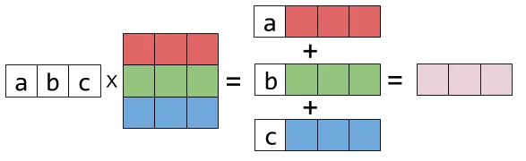
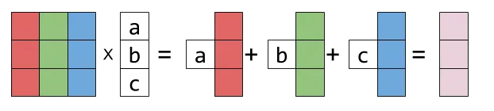

https://learnopengl.com/Getting-started/Coordinate-Systems

Coordinate systems:

- MeshSpace (often omitted): relative to a certain mesh in a model. E.g. mesh has it's own front vector, because it's rotated 45 degrees to the left, so it's front is 45 degs to the left from model's front. No need in it when all transforms are applied to meshes (In Blender: Shift + A -> Apply transforms. That recalculates mesh space triangle coords to model space. If mesh's origin it at (2, 0, 0) and it's vertex had coords (1, 2, 3), then in MS it will have coords (3, 2, 3))
- ModelSpace (MS): relative to model's origin
- WorldSpace (WS): relative to world's origin (0, 0, 0)
- ViewSpace (VS): relative to camera's position and rotation. Vertex with coords (0, 0, 1) is 1 unit in front of the camera (Or 1 at the back. Depends on the chosen coordinate system (Using projection matrix))
- ClipSpace (CS): Normalized Device Coordinates: usually [-1; 1] for x and y and [-1; 1] / [0; 1] or their reversed versions for z
- ScreenSpace (SS): You transform to theese via Viewport. You can set near, far, etc inside D3D11_VIEWPORT_DESC

Also

- TangentSpace: relative to a triangle's surface

---

The usual transformation pipeline is:

$$
ModelSpace -> WorldSpace -> ViewSpace -> ClipSpace -> Normalised Device Coordinates -> Screen Space Coordinates
$$

---

Space Transformation Matrices naming on different sites

model = MS -> WS

world = WS -> VS

etc..

Inversed matrices do the opposite thing, e.g.

modelInv = WS -> MS


---

**View Matrix** is essentially an **inversed Model Matrix**. If we want to place a camera on a certain position and have a certain rotation, we can construct a Model Matrix with the given data and inverse it to get the View Matrix.

---

"A rotation matrix is just a transform that expresses the basis vectors of the input space in a different orientation."

https://paroj.github.io/gltut/Positioning/Tut06%20Rotation.html#:~:text=A%20rotation%20matrix%20is%20just,basis%20vectors%20will%20not%20change.

We can construct a rotation matrix using basis vectors (orths) the following way:

$$
\begin{pmatrix}
  R_x & U_x & F_x \\
  R_y & U_y & F_y \\
  R_z & U_z & F_z
\end{pmatrix}
$$

The rotation matrix can be transposed to rotate in the opposite direction.

Notice that viewMatrix is an inversed rotation matrix because we want to rotate the world in the opposite direction from where we want to move

$$
\begin{pmatrix}
  R_x & R_y & R_z \\
  U_x & U_y & U_z \\
  F_x & F_y & F_z
\end{pmatrix}
$$

$$
\begin{pmatrix}
  R_x & R_y & R_z & 0\\
  U_x & U_y & U_z & 0\\
  F_x & F_y & F_z & 0\\
  P_x & P_y & P_z & 1
\end{pmatrix}
$$

Also, viewMatrix can be composed from Rotation and Translation matrices


---

Space transform matrices should be read right to left

$$
positionCS = projection * view * model * positionMS
$$

Means:

$$
model -> world -> view -> clip
$$

---

When we want to go from ClipSpace to ModelSpace, the position should still be on the right, however the order of transformation matrices is inversed:

$$
positionMS = modelInv * viewInv * projectionInv * positionCS
$$

Because firstly we go from ClipSpace to ViewSpace. Remember, we should read multiplication from the right to the left:

$$
clip -> view -> world -> model
$$

---

$$
projection * view * model * position
$$

Is equal to

$$
(projection * (view * (model * position)))
$$

Because matrix multiplication is associative, i.e.

$$
(A * B) * C = A * (B * C)
$$

The only thing that matters is the order of elements

---

In general case, **view * model** is not equal to  **transpose(model * view)**, because

$$
transpose(A * B) = transpose(A) * transpose(B)
$$

$$
transpose(view * model) = transpose(view) * transpose(model)\\
transpose(view * model) = viewInv * modelInv\\
$$

As you may notice, the order of inverse transformation is wrong as we need to go from ViewSpace to WorldSpace at first

positionMS **is not equal to** viewInv * modelInv * positionCS

---

However, the following is correct

$$
matrix * position = position * transpose(matrix)
$$

It comes from how we conjugate and multiply matrices and row/column vectors

https://medium.com/geekculture/right-and-left-matrix-multiplication-d21947f195d8





<!-- ??? Not. Only for transpose

Let's substitute MVP

$$
matrix * position = position * transpose(matrix)\\
projection * view * model * position = position * projectionInv * viewInv * modelInv
$$ -->

---

The same way of groupping applies to the inversion

$$
inverse(A * B) = inverse(A) * inverse(B)
$$

---

More examples of groupping

$$
(2 * A * B^T + C)^T = 2 * B * A^T + C^T
$$

The sum **can't** be decomposed that way with inversion. However, there are more complex lemmas and formulas about representing inverse of the sum of elements with member matrices and their inversion

---

In hlsl there are **row_major** and **col_major** matrices and the latter are default when it comes to **input layouts** and **constant buffers**.

But when you create matrices in code, its **constructor** is always **row_major**

$$
float3x3(a11, a12, a13, a21, a22, a23, a31, a32, a33)
$$

for

$$
\begin{pmatrix}
  a11 & a12 & a13 \\
  a21 & a22 & a23 \\
  a31 & a32 & a33
\end{pmatrix}
$$

and

$$
float3x3(A, B, C)
$$

for

$$
\begin{pmatrix}
  A_x & A_y & A_z \\
  B_x & B_y & B_z \\
  C_x & B_y & C_z
\end{pmatrix}
$$

---

Transformation matrices apply in the following order:

$$
scale -> rotation -> translation
$$

---

**TangentSpace** is relative to the triangle and if we want to work with it in a certain space, we need to move it to that space at first. We can do that both ways: transforming basis vectors and creating matrice out of them or creating matrice at first and then transforming it.

$$
normalWS = model * mesh * tbn * normalTS
$$

That way, we get a normal in TangentSpace, move it to ModelSpace and then to WorldSpace

"Here we first transform all the TBN vectors to the coordinate system we'd like to work in, which in this case is world-space as we multiply them with the model matrix. Then we create the actual TBN matrix by directly supplying mat3's constructor with the relevant column vectors."

https://learnopengl.com/Advanced-Lighting/Normal-Mapping

```cpp
// Remember, no row_major
glm::vec3 rightMS(1, 0, 0);
glm::vec3 upMS(0, 1, 0);
glm::vec3 frontMS(0, 0, 1);

glm::mat3 transform = glm::eulerAngleY(glm::radians(32.77f));
glm::vec3 rightWS = transform * rightMS;
glm::vec3 upWS = transform * upMS;
glm::vec3 frontWS = transform * frontMS;

glm::mat3 tbnMS(
  rightMS,
  upMS,
  frontMS
);

glm::mat3 tbnWS0(
  rightWS,
  upWS,
  frontWS
);
glm::mat3 tbnWS1(
  rightMS,
  upMS,
  frontMS
);
tbnWS1 = transform * tbnWS1;

std::cout << "TBN MS:\n" << tbnMS << '\n';
std::cout << "TBN 0-hypothesis:\n" << tbnWS0 << '\n';
std::cout << "TBN rotate hypothesis:\n" << tbnWS1 << '\n';

// Here tbnWS0 == tbnWS1
```

If we have a mesh in **MeshSpace** that is a part of a model in **ModelSpace**, and we want to transform it's micronormal to the **WorldSpace**, then we need to cast TBN components to ModelSpace, then to WorldSpace.

---

TBN matrix is constructed the same way as we construct a rotation matrix:

$$
\begin{pmatrix}
  T_x & B_x & N_x\\
  T_y & B_y & N_y\\
  T_z & B_z & N_z
\end{pmatrix}
$$

---

Rotation matrix is a model matrix. We can think of its construction as S * R * T with S and T = identity

---

When generating IBL, we are not moving coordinates into the basis. We are drawing in the basis (in CS), abstracting ourselves from cube faces, so we need to get coordinates from basis

$$
  coordWS = inverse(basis) * coordWS
$$

---

---

Translation matrix takes the following form.

All shown matrices are constructed for multiplication by a column vector (read right to left)

$$
\begin{pmatrix}
  1 & 0 & 0 & T_x\\
  0 & 1 & 0 & T_y\\
  0 & 0 & 1 & T_z\\
  0 & 0 & 0 & 1
\end{pmatrix}
*
\begin{pmatrix}
  P_x\\
  P_y\\
  P_z\\
  1
\end{pmatrix}
=
\begin{pmatrix}
  1 * P_x + T_x * 1\\
  1 * P_x + T_x * 1\\
  1 * P_x + T_x * 1\\
  1 * 1
\end{pmatrix}
=
\begin{pmatrix}
  P_x + T_x\\
  P_x + T_x\\
  P_x + T_x\\
  1
\end{pmatrix}
$$

---

Scaling matrix takes the following form.

$$
\begin{pmatrix}
  S_x & 0 & 0 & 0\\
  0 & S_y & 0 & 0\\
  0 & 0 & S_z & 0\\
  0 & 0 & 0 & 1
\end{pmatrix}
*
\begin{pmatrix}
  P_x\\
  P_y\\
  P_z\\
  1
\end{pmatrix}
=
\begin{pmatrix}
  S_x * P_x\\
  S_y * P_y\\
  S_z * P_z\\
  1
\end{pmatrix}
$$

---

Combination of scale and translation:

$$
\begin{pmatrix}
  S_x & 0 & 0 & T_x\\
  0 & S_y & 0 & T_y\\
  0 & 0 & S_z & T_z\\
  0 & 0 & 0 & 1
\end{pmatrix}
*
\begin{pmatrix}
  P_x\\
  P_y\\
  P_z\\
  1
\end{pmatrix}
=
\begin{pmatrix}
  S_x * P_x + T_x\\
  S_y * P_y + T_y\\
  S_z * P_z + T_z\\
  1
\end{pmatrix}
$$

---

Combination of scaling and translation is all the magic behind perspective matrices. But let's take it one step at a time and take a look at the entire process of going from **ViewSpace** to **ClipSpace**.

In modern Graphics APIs, it's you, who determine the ClipSpace boundaries, by creating a **Projection Matrix** and setting a **Viewport**.

The Viewport is used to map coords from ClipSpace to ScreenSpace internally (but you can do it manually if you need the results).

https://learn.microsoft.com/en-us/windows/win32/api/d3d11/ns-d3d11-d3d11_viewport

```cpp
struct D3D11_VIEWPORT {
  float TopLeftX;
  float TopLeftY;
  float Width;
  float Height;
  float MinDepth;
  float MaxDepth;
}
```

- Width and Height are the obvious ones.

- TopLeftX and TopLeftY can go from D3D11_VIEWPORT_BOUNDS_MIN D3D11_VIEWPORT_BOUNDS_MAX (-32768 to -32767). Width and Height must be >= 0 and TopLeftX + Width and TopLeftY + Height must be <= D3D11_VIEWPORT_BOUNDS_MAX.

You can use theese to **flip screen coords** vertically, horizontally or diagonally

You may have heard that OpenGL have (0, 0) in TopLeft corner and DirectX in BottomLeft. Well, now it's you who decide.

- MinDepth and MaxDepth. Theese are used to interpret the result in **z-coordinate** (How far from camera)

---

Prespective matrix is just a Scale-Translation matrix. It's purpose it to map coordinates from ViewSpace to ClipSpace.

Orthographic matrix (One of the variations):

$$
\begin{pmatrix}
  \frac{2}{right - left} & 0 & 0 & \frac{-right-left}{right-left}\\
  0 & \frac{2}{top - bottom} & 0 & \frac{-top-bottom}{top-bottom}\\
  0 & 0 & \frac{2}{far - near} & \frac{-far-near}{far-near}\\
  0 & 0 & 0 & 1
\end{pmatrix}
$$

All we do is **normalizing ViewSpace coordinates** [-inf +inf] to [0, 1] and **mapping that range to** [-1, 1] (**or our desired coordinate system**)

How normalization works:

$$
0 / 10 = 0 (0\%)\\
5 / 10 = 0.5 (50\%)\\
10 / 10 = 1 (100\%)
$$

For z coordinate let's assume:

$$
far = 1000\\
near = 10\\
P_z = 1000
$$

Now we have

$$
far - near = 990\\
S_z = \frac{1}{far - near} = \frac{1}{990} = 0.001010\\
2 * S_z * P_z = 2 * 0.001010 * 1000 = 2.02020
$$

Quite too much, we wanted 1. Also we have a fractional part. But let's look further

$$
T_z = \frac{-far-near}{far-near} = \frac{-1010}{990} = -1.0202\\
P_z' = S_z * P_z + T_z = 2.02020 - 1.0202 = 1
$$

Exactly what we wanted. As you may noticed, we just

- **Normalized coordinates** with regards to **min** and **max** range (to a range, similar to [0, 1])
- Went from [0, 1] to [-1, 1] with a formula P' = 2 * P - 1

2 in the fraction is just for that purpose

$$
\frac{2}{far - near}
$$

And here we got approx. -1 (+ offset for min range)

$$
\frac{-far-near}{far-near} = \frac{-1010}{990} = -1.0202
$$

We are not using exactly 2 for scale and -1 for translation because we need to account for the min range.

---

But why did we get 1? If you take **near** relatively small, then **far + near** and **far - near** will be really close and give approx. 1 after division

You may also need to map to [0, 1]. The formula is P' = 1 * P + 0. **How to get 0?**

$$
T_z = \frac{-near}{far-near} = \frac{-10}{990} = -0.0101
$$

We just removed **far** from the numerator

There is a trick to understand that. In the limits theory, there are infinitely small and infinitely big values.

- If we divide any real number by an infinitely big value (**inf**), you get infinitely small walue (**0**) (R / inf ~ 0)
- And vice versa R / 0 ~ inf
- Regular sign rules work here too: **-** / **-** = **+**;
- 0 + 0 ~ 0
- inf + inf ~ inf
- inf - 0 ~ inf
- **Except for inf / inf**. We have real numbers in calculations, so **R / R ~ 1, R != 0**

Then we can take **near** as **0** and **far** as **inf**

$$
T_z = \frac{-near}{far-near} \sim \frac{-0}{\infty - 0} \sim \frac{-0}{\infty} \sim -0
$$

$$
T_z = \frac{-far-near}{far-near} \sim \frac{-\infty - 0}{\infty - 0} \sim \frac{-\infty}{\infty} \sim \frac{-R}{R} = -1
$$

---

How to map to **reverse-z** [1, 0]?

We start with [0, 1].

We can't multiply 0 by anything, so to make it 1 we just add 1, so T_z = 1

Now we need to find S_z

$$
S_z * 1 + T_z = 0\\
S_z * 1 + 1 = 0\\
-1 * 1 + 1 = 0\\
S_z = -1
$$

---

Now, if you find any projection matrix, you will be able to transform it to your needs. Let's take a look at some other possibilities:

- Reverse camera Z axis by **placing minus in front of S_z**
- Create a reversed z buffer by replacing **near** and **far** and mapping not to [0, 1], but to [1, 0], by changing scale and translation

---

For perspective matrix

$$
S_x = ctgHalfFovY / aspect = \frac{1}{ctgHalfFovX * aspect}
$$

$$
S_y = ctgHalfFovY = \frac{1}{ctgHalfFovX}
$$

$$
ctgHalfFovY = \frac{adjacentCathetus}{oppositeCathetus} = \frac{depth}{\frac{height}{2}} = \frac{2 * depth}{height}
$$

$$
aspect = \frac{width}{height}
$$

So, we have

$$
S_x = \frac{2 * depth}{height} * \frac{height}{width} = \frac{2 * depth}{width}
$$

$$
S_y = \frac{2 * depth}{height}
$$

Let's transform this to a more familiar look

$$
S_x = \frac{2}{width} * depth
$$

$$
S_y = \frac{2}{height} * depth
$$

Pretty simple so far. Now let's look at Z

$$
S_z = \frac{2.0 * near}{far - near} = 2 * 0.010101 = 0.020202
$$

2.0f * far * near / (far - near) = 20.202020

2.0f * near / (far - near) * far = 0.020202 * 1000

WTF

$$
\begin{pmatrix}
  \frac{ctg(\frac{\theta}{2})}{aspect} & 0 & 0 & 0\\
  0 & ctg(\frac{\theta}{2}) & 0 & 0\\
  0 & 0 & \frac{2 * near}{far - near} & -1\\
  0 & 0 & \frac{2 * near}{far - near} * far & 0
\end{pmatrix}
$$

$$
\begin{pmatrix}
  \frac{ctg(\frac{\theta}{2})}{aspect} & 0 & 0 & 0\\
  0 & ctg(\frac{\theta}{2}) & 0 & 0\\
  0 & 0 & \frac{2 * near}{far - near} & -1\\
  0 & 0 & \frac{2 * near}{far - near} * far & 0
\end{pmatrix}
*
\begin{pmatrix}
  P_x\\
  P_y\\
  P_z\\
  1
\end{pmatrix}
=
\begin{pmatrix}
  S_x * P_x\\
  S_y * P_y\\
  S_z * P_z - 1\\
  S_z * P_z
\end{pmatrix}
$$

$$
\begin{pmatrix}
  \frac{S_x * P_x}{S_z * P_z}\\
  \frac{S_y * P_y}{S_z * P_z}\\
  \frac{S_z * P_z - 1}{S_z * P_z}
\end{pmatrix}
=
\begin{pmatrix}
  P_x'\\
  P_y'\\
  1 - \frac{1}{S_z * P_z}
\end{pmatrix}
$$

FUCK THIS SHIT

https://habr.com/ru/articles/252771/
